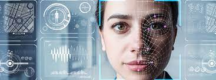

# Microsoft_FaceRecognition_Project

 Facial recognition is a way of identifying or confirming an individual’s identity using their face. Facial recognition systems can be used to identify people in photos, videos, or in real-time.
